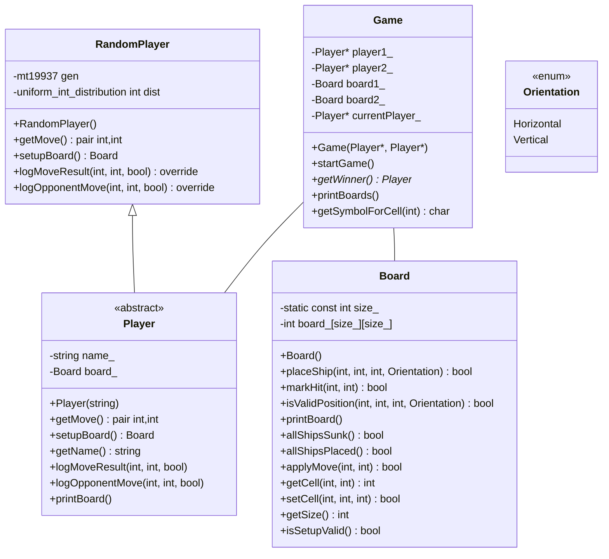

# Projekt Potapljanje ladjic (Battleship)

## Igra potapljanje ladjic

Potapljanje ladjic (_Battleship_) je klasična pomorska strateška igra, v kateri vsak igralec poskuša potopiti floto ladij drugega igralca tako, da ugiba njihove lokacije na mreži. Ta izvedba igre potapljanje ladjic je zasnovana kot programerski izziv, ki uporabnikom omogoča, da ustvarijo in preizkusijo svoje avtomatizirane igralce v skladu s pravili igre.

## Struktura projekta

- `src`: Vsebuje datoteke izvorne kode (`.cpp`) za glavno logiko igre in implementacije igralcev.
- `include`: Vsebuje datoteke glave (`.h`), ki opredeljujejo razrede in vmesnike, uporabljene v igri.
- `tests`: Mapa za teste enot za preverjanje funkcionalnosti igre in njenih sestavnih delov.
- `CMakeLists.txt`: Datoteka s konfiguracijo za izgradnjo projekta s programom CMake.

## Razredni diagram



## Pravila igre in izvedba

Vsak igralec postavi svojo floto ladij.
Igralci izmenično ugibajo koordinate mreže in napadajo nasprotnikove ladje.
Igra se nadaljuje, dokler en igralec ne potopi vseh nasprotnikovih ladij oz. dokler ni preseženo določeno število potez. Igralec, ki zadane nasprotnikovo ladjo lahko ponovno ugiba, vendar največ 20-krat zapored.

## Podrobnosti o izvajanju

Osnovna logika igre se izvaja v razredih `Game`, `Board` in `Player`.
Razred `Player` je abstraktni osnovni razred, od katerega morajo dedovati vse vrste igralcev. Opredeljuje vmesnik, ki ga mora upoštevati vsaka implementacija igralca.

## Dodajanje lastnega igralca

Če želite v igro dodati svojega igralca, sledite naslednjim korakom:

- Ustvarite razred igralca:

    Ustvarite nov razred, ki razširja osnovni razred `Player`. Za izhodišče pisanja svojega razreda uporabite predlogi `s232xxxxx.h` in `s232xxxxx.cpp`, ki vsebujeta isto kodo kot razred `RandomPlayer`.
    Najprej ju prilagodite glede na svoje podatke, kar naredite s popravki na naslednjih mestih, tako da zamenjate `xxxxx` z zadnjimi 5 znaki vaše vpisne številke:

    - v imenih datotek razreda (`.h` in `.cpp`)
    - v imenu imenskega prostora (_namespace_), znotraj katerega definirate svoj razred PlayerStudent (ime razreda ostaja enako); ustrezno popravite v obeh datotekah
    - v konstruktorju pri inicializaciji baznega razreda (`Player("xxxxx")`).

    Obstoječo programsko kodo v predlogah ustrezno nadgradite tako, da bo v tekmovanju dosegla čim boljši rezultat! Have fun :)

- Postavite kodo v prave mape:

    Postavite svojo glavno datoteko (`.h`) v mapo `include/players`, drugo datoteko (`.cpp`) pa v mapo `src/players`.
    Obe datoteki poimenujte s svojo vpisno številko! Npr., če je vaša vpisna številka 23200000, potem naj bosta datoteki poimenovani `s23200000.h` in `s23200000.cpp`.

- Napišite in izvedite teste:
    V mapi `tests` lahko ustvarite testne primere za svojega igralca.
    Prepričajte se, da se vaš igralec pravilno obnaša v različnih scenarijih igre. Spremenite tudi datoteko `CMakeLists.txt`, da bo v postopek gradnje vključila vaš test.

- Integracija z glavno igro:
    Po potrebi lahko spremenite kodo glavne igre, da bo vključevala vašega igralca kot možnost za igranje.

- Dokumentirajte kodo svojega igralca:
    Dodajte komentarje in dokumentacijo, ki pojasnjujejo strategijo in algoritme, ki jih uporablja vaš igralec. To pomaga bralcu kode razumeti vaš pristop.

### Navodila za postavljanje ladjic

Nobeni postavljeni ladjici se ne smeta stikati med seboj - ne vodoravno in navpično ne diagonalno. To preverja funkcija `Board::isSetupValid()`. Funkcija je med drugim namenjena uporabi pri postavljanju postavitve (npr. igralec lahko naključno generira postavitev in preveri, ali je ta veljavna), se pa uporablja tudi pri izvedbi tekmovanja. V kolikor igralec postavi ladjice napačno, dobi točke za zmago nasprotni igralec.

## Zagon tekmovanja

Če želite preveriti delovanje vaše kode, morate objekt `s232xxxxx::PlayerStudent` dodati v vektor igralcev `players` v datoteki `main.cpp`. Bodite pozorni, da je število elementov v vektorju `players` enako vrednosti izraza `numPlayers`, ki je definiran na začetku funkcije main.

Znotraj druge izmed dveh `for` zank, ki iz vektorja `players` izbirata pare igralcev, se izvede število odigranih iger med izbranima igralcema. Število odigranih iger se določa z argumentom funkcije `Game::startMatch(int reps)`.

Na koncu tekmovanja so podani rezultati v zbirni tabeli, ki se shranjujejo tudi v datoteko `results.txt`, ki se nahaja znotraj `build` mape.

### Grajenje kode s CMake ročno

```ps
cd /Vaje/Battleship
mkdir build
cd build

cmake ../BattleshipGame

cmake --build .
```

## Navodila za oddajo

Svoji ustrezno poimenovani datoteki oddate preko spletne učilnice. Programsko kodo naj spremlja predstavitev rešitve v pisni obliki.
